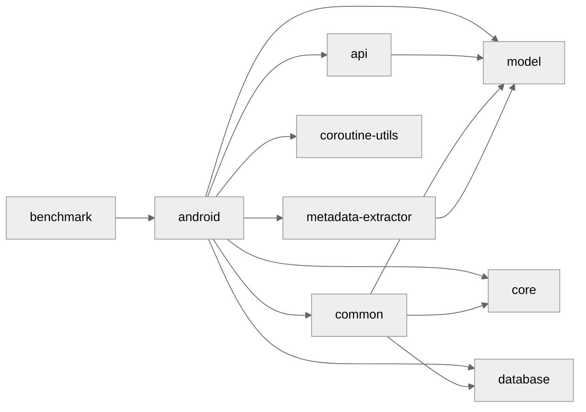

# Claw for [lobste.rs](https://lobste.rs) 

Unofficial Android app for read-only access to [lobste.rs](https://lobste.rs), built with [Jetpack Compose](https://developer.android.com/jetpack/compose).

> Snapshots from the development branch can be obtained [here](https://github.com/msfjarvis/compose-lobsters/releases/tag/nightly).

## Dependency Diagram

## License

See [LICENSE](LICENSE)