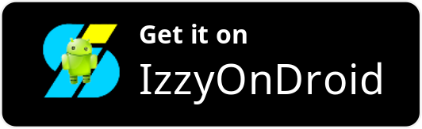

# Claw for [lobste.rs](https://lobste.rs) 

Unofficial Android app for read-only access to [lobste.rs](https://lobste.rs), built with [Jetpack Compose](https://developer.android.com/jetpack/compose).

> [!NOTE]
> Daily builds are published to the Google Play 'Open Testing' channel (if there are any changes), which can be opted into via this link: [[Android]](https://play.google.com/store/apps/details?id=dev.msfjarvis.claw.android) [[Web]](https://play.google.com/apps/testing/dev.msfjarvis.claw.android)

## License

See [LICENSE](LICENSE)
